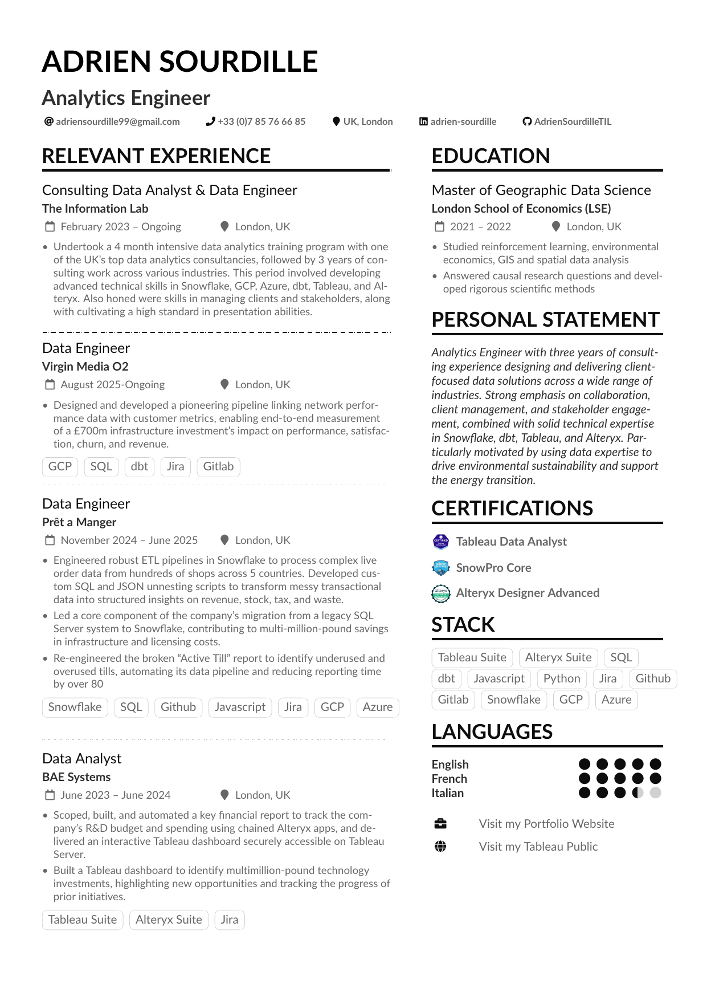
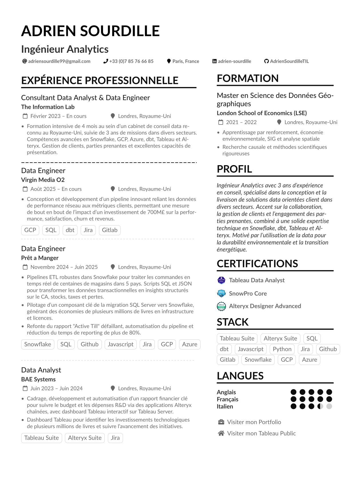

# Adrien Sourdille - CV

Personal CV repository for **Adrien Sourdille**, Analytics Engineer based in London, UK.

Available in English and French, built with LaTeX using the [AltaCV](https://github.com/liantze/AltaCV) template.

## Preview

### English Version


[Download PDF](Adrien_Sourdille_CV/output/CV_EN.pdf)

### French Version


[Download PDF](Adrien_Sourdille_CV/output/CV_FR.pdf)

## Structure

```
Adrien_Sourdille_CV/
├── CV_EN.tex          # English CV source
├── CV_FR.tex          # French CV source
├── images/            # Certification logos & assets
├── output/            # Generated PDFs
├── altacv.cls         # AltaCV template class
└── latexmkrc          # Build configuration
```

## Build

Navigate to the CV folder and compile:

```bash
cd Adrien_Sourdille_CV
latexmk -pdf CV_EN.tex
latexmk -pdf CV_FR.tex
```

Or with XeLaTeX:

```bash
xelatex -shell-escape CV_EN.tex
xelatex -shell-escape CV_FR.tex
```

PDFs will be output to the `output/` folder, auxiliary files to `aux/`.

## Contact

- Email: adriensourdille99@gmail.com
- LinkedIn: [adrien-sourdille](https://linkedin.com/in/adrien-sourdille)
- GitHub: [AdrienSourdilleTIL](https://github.com/AdrienSourdilleTIL)
- Portfolio: [adriensourdilletil.github.io](https://adriensourdilletil.github.io/AdrienSourdillePortfolio/)

---

*Based on [AltaCV](https://github.com/liantze/AltaCV) by LianTze Lim*
